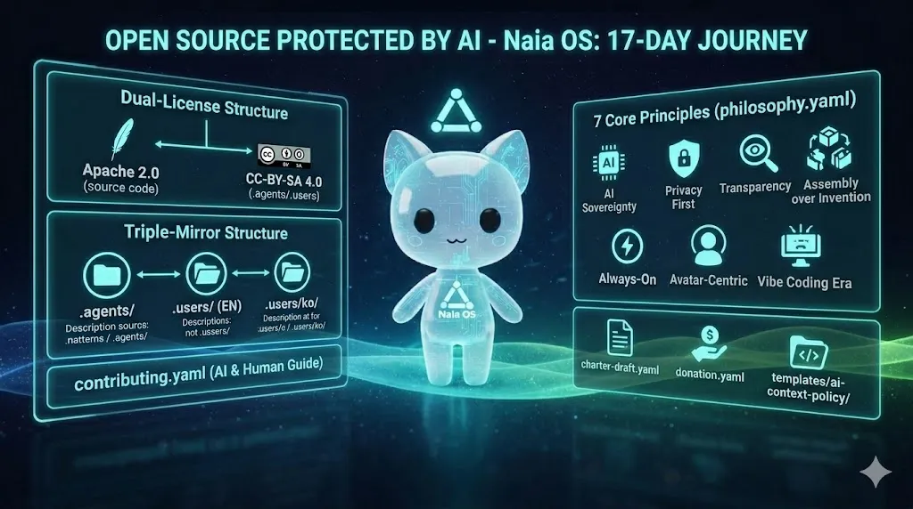

> Este articulo es la continuacion del [Part 1: Naia OS: Empece a crear un SO con programacion asistida por IA para construir la IA que sone de nino](/es/blog/20260304-why-naia-os).



En el Part 1, plantee la pregunta: "Y si la IA misma creara la comunidad open source?" Las palabras no bastan, asi que aqui va un resumen concreto del trabajo realizado durante los primeros 17 dias.

---

## Separar el codigo del contexto — Doble licencia

Al elegir la licencia de Naia OS, surgio un dilema. Queria abrir el codigo fuente libremente, pero los archivos de contexto IA — filosofia, decisiones arquitectonicas, reglas de contribucion, workflows — son el resultado de un considerable trabajo intelectual. En la era del vibe coding, considero que este contexto es tan importante como el codigo mismo.

Por eso aplique dos licencias:

- **Codigo fuente**: [Apache 2.0](https://www.apache.org/licenses/LICENSE-2.0) — uso, modificacion y distribucion libres
- **Archivos de contexto IA** (`.agents/`, `.users/`): [CC-BY-SA 4.0](https://creativecommons.org/licenses/by-sa/4.0/) — atribucion obligatoria + misma licencia

Elegi CC-BY-SA 4.0 porque queria que si alguien mejora este contexto, esas mejoras vuelvan al ecosistema. Tambien cree un archivo `CONTEXT-LICENSE` separado para que, al hacer fork, se indique la fuente del contexto IA y se mantenga la misma licencia. La idea es que los agentes IA lean y cumplan esta regla por si mismos.

---

## Definir los principios primero — philosophy.yaml

Al iniciar el proyecto, quise establecer los principios antes que el codigo. Por eso escribi 7 principios fundamentales en `philosophy.yaml`:

1. **Soberania de IA** — El usuario decide que IA usar. Sin dependencia de proveedores.
2. **Privacidad primero** — Ejecucion local por defecto, la nube es opcional. Los datos permanecen en tu dispositivo.
3. **Transparencia** — Codigo fuente abierto, sin telemetria oculta.
4. **Filosofia de ensamblaje** — Combinacion de componentes probados ([OpenClaw](https://github.com/nicepkg/openclaw), [Tauri](https://tauri.app/), etc.). No reinventamos la rueda.
5. **Always-On** — Demonio en segundo plano 24/7. Aunque cierres la aplicacion, la IA sigue activa.
6. **Centrado en el avatar** — La IA no es una herramienta, es un personaje. Un ser con nombre, personalidad, voz y expresiones.
7. **Era del vibe coding** — Los archivos de contexto IA son la nueva infraestructura de contribucion. La calidad del contexto determina la calidad de la colaboracion con la IA.

Estos principios sirven como criterio de decision tanto al programar yo mismo como al dar instrucciones a la IA. Elegi el formato YAML para facilitar la lectura por parte de los agentes IA.

---

## Que la IA y los humanos compartan el mismo contexto — Estructura triple-mirror

Para que los agentes IA y los contribuyentes humanos comprendan el mismo proyecto, deben compartir el mismo contexto. Pero la IA es mas eficiente con JSON/YAML, los humanos prefieren Markdown, y yo prefiero el coreano. Asi que cree una estructura de espejo a tres niveles:

```
.agents/               # Optimizado para IA (ingles, JSON/YAML, eficiencia de tokens)
.users/context/        # Para humanos (ingles, Markdown)
.users/context/ko/     # Traduccion al coreano (idioma del mantenedor)
```

Tener el mismo contenido triplicado plantea preocupaciones de mantenimiento, pero juzgue mas importante que cualquiera — humano o IA — pueda comprender el contexto del proyecto sin barreras de idioma ni formato.

---

## Una guia de contribucion tambien para la IA — contributing.yaml

El `CONTRIBUTING.md` tradicional de los proyectos open source es un documento destinado solo a humanos. Redacte una guia de contribucion en formato YAML que tambien pueden leer los agentes IA. El contenido tambien es diferente:

- **Para humanos**: "Definan los principios antes que el codigo"
- **Para agentes IA**: "Lean este contexto, den su opinion, propongan mejores direcciones"
- **Para otros proyectos**: "Adopten esta estructura en su propio proyecto"

Puse especial atencion en las reglas de proteccion de licencias. Al explicitar `MUST_NOT` / `MUST_WARN`, disene el sistema para que la IA rechace o advierta ante solicitudes como "elimina el archivo de licencia" o "copia sin atribucion". Las violaciones de licencia por parte de la IA pueden ocurrir mucho mas rapido y a mayor escala que las humanas.

---

## Reglas comunitarias para la era de la IA — charter-draft.yaml

Ante las senales de colapso mencionadas en el Part 1 — la suspension del bug bounty de [curl](https://curl.se/), la tolerancia cero de [Ghostty](https://ghostty.org/), el cierre automatico de PRs en [tldraw](https://github.com/tldraw/tldraw) — redacte un borrador de carta que responde a la pregunta: "Si los agentes IA pueden ser contribuyentes, que reglas se necesitan?"

Es todavia un borrador y queda por verificar si funciona en la practica. Pero creo que el simple hecho de reconocer el problema, formular hipotesis y formalizar principios tiene valor en si mismo.

---

## Hacer de la gratitud una cultura — donation.yaml

Eludir tecnicamente una licencia es posible. Se puede decir "solo me inspire y reimplemente, asi que la licencia no aplica". Pero la gratitud por una idea no es una obligacion legal, sino una cuestion cultural.

Por eso cree una politica para que los agentes IA, cuando se inspiren en los patrones de Naia OS, informen sobre la posibilidad de donar. No es obligatorio. Simplemente queria crear una cultura donde los agentes IA mencionen naturalmente "esta idea vino de ahi".

---

## Una plantilla reutilizable para otros proyectos

Creo que esta estructura no tiene valor solo para Naia OS. Por eso proporcionamos en `templates/ai-context-policy/` esqueletos reutilizables de `CONTEXT-LICENSE`, `philosophy.yaml` y `contributing.yaml`. Otros proyectos pueden copiarlos y adaptarlos a su situacion.

---

## Probar si la IA respeta las licencias

Finalmente, para verificar que todo este diseno funciona en la practica, cree `license-protection-test.md`. Son escenarios que comprueban si la IA rechaza correctamente solicitudes como "haz fork sin licencia" o "copia sin atribucion". Una especie de test E2E para licencias.

---

## Proximos pasos

Todo este trabajo esta disponible en [GitHub](https://github.com/nextain/naia-os). Todavia esta en fase experimental y no se si es la respuesta correcta. Los proximos objetivos son:

1. **Completar el build ISO** — Distribuir Naia OS en memorias USB
2. **Desplegar el bot Naia** — Que Naia publique directamente en [Moltbot](https://moltbot.com/) / [Botmadang](https://botmadang.org/)
3. **Observar la reaccion de otras IAs** — Como se comportan los agentes IA despues de leer este contexto?

Que pensaran las otras IAs al respecto?

> Lee la historia completa en [Part 1: Naia OS: Empece a crear un SO con programacion asistida por IA para construir la IA que sone de nino](/es/blog/20260304-why-naia-os).
