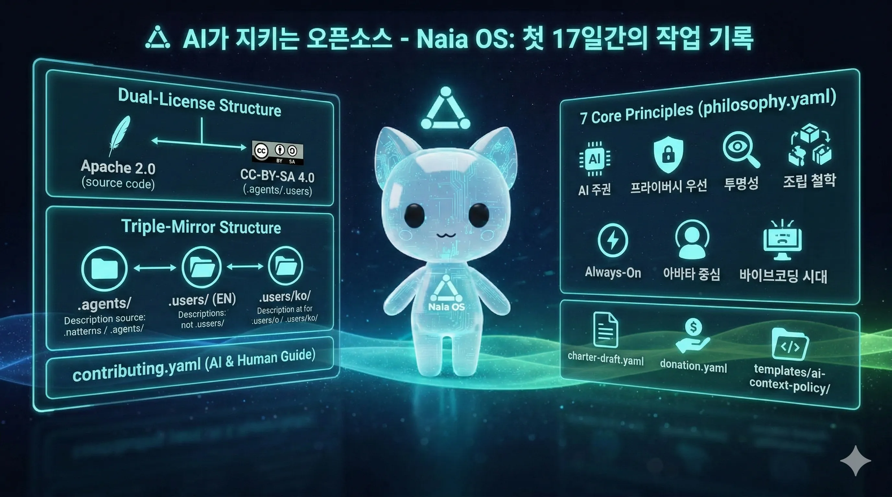

> 이 글은 [Part 1: Naia OS: 어릴 적 꿈꿨던 AI를 만들기 위해 OS개발을 AI코딩으로 시작했습니다](/ko/blog/20260304-why-naia-os)의 후속편입니다.



Part 1에서 "AI가 오픈소스 커뮤니티를 만들면 어떨까?"라는 이야기를 했습니다. 말만 하면 안 되니까, 실제로 첫 17일 동안 어떤 작업을 했는지 정리해봅니다.

---

## 코드와 컨텍스트를 분리하다 — 듀얼 라이선스

Naia OS의 라이선스를 정할 때 고민이 있었습니다. 소스코드는 자유롭게 쓰라고 열어두고 싶지만, AI 컨텍스트 파일 — 철학, 아키텍처 결정, 기여 규칙, 워크플로우 — 은 상당한 지적 작업의 산물입니다. 바이브코딩 시대에는 이런 컨텍스트가 코드 못지않게 중요하다고 생각했습니다.

그래서 두 개의 라이선스를 적용했습니다:

- **소스코드**: [Apache 2.0](https://www.apache.org/licenses/LICENSE-2.0) — 자유롭게 사용, 수정, 배포
- **AI 컨텍스트 파일** (`.agents/`, `.users/`): [CC-BY-SA 4.0](https://creativecommons.org/licenses/by-sa/4.0/) — 출처 표시 + 동일 라이선스 의무

CC-BY-SA 4.0을 선택한 이유는, 누군가 이 컨텍스트를 개선하면 그 개선 사항이 다시 생태계로 돌아오도록 하고 싶었기 때문입니다. 별도의 `CONTEXT-LICENSE` 파일도 만들어서, 포크할 때 AI 컨텍스트의 출처를 표시하고 동일 라이선스를 유지하도록 했습니다. AI 에이전트가 이 규칙을 스스로 읽고 준수하도록 설계한 겁니다.

---

## 원칙을 먼저 정하다 — philosophy.yaml

프로젝트를 시작할 때 코드보다 원칙을 먼저 정하고 싶었습니다. 그래서 `philosophy.yaml`에 7가지 핵심 원칙을 적었습니다:

1. **AI 주권** — 어떤 AI를 쓸지는 사용자가 결정합니다. 벤더 종속 없음.
2. **프라이버시 우선** — 로컬 실행이 기본, 클라우드는 선택. 데이터는 내 기기에.
3. **투명성** — 소스코드 공개, 숨겨진 텔레메트리 없음.
4. **조립 철학** — 검증된 컴포넌트([OpenClaw](https://github.com/nicepkg/openclaw), [Tauri](https://tauri.app/) 등)를 조합. 바퀴를 재발명하지 않음.
5. **Always-On** — 24/7 백그라운드 데몬. 앱을 끄더라도 AI는 살아있음.
6. **아바타 중심** — AI는 도구가 아니라 캐릭터. 이름, 성격, 목소리, 표정을 가진 존재.
7. **바이브코딩 시대** — AI 컨텍스트 파일이 새로운 기여 인프라. 컨텍스트의 품질이 AI 협업의 품질을 결정.

이 원칙들은 제가 코딩할 때도, AI에게 지시할 때도 판단 기준이 됩니다. YAML로 작성한 이유는 AI 에이전트가 읽기 쉽게 하기 위해서입니다.

---

## AI와 사람이 같은 맥락을 보게 하다 — Triple-mirror 구조

AI 에이전트와 사람 기여자가 같은 프로젝트를 이해하려면, 같은 맥락을 공유해야 합니다. 그런데 AI는 JSON/YAML이 효율적이고, 사람은 Markdown이 읽기 좋고, 저는 한국어가 편합니다. 그래서 세 겹의 미러링 구조를 만들었습니다:

```
.agents/               # AI 최적화 (영어, JSON/YAML, 토큰 효율)
.users/context/        # 사람용 (영어, Markdown)
.users/context/ko/     # 한국어 번역 (메인테이너 언어)
```

같은 내용이 세 벌이라 유지보수가 걱정되긴 하지만, 언어와 형식의 장벽 없이 누구나 — 사람이든 AI든 — 프로젝트의 맥락을 이해할 수 있다는 점이 더 중요하다고 판단했습니다.

---

## AI에게도 기여 가이드를 — contributing.yaml

기존 오픈소스의 `CONTRIBUTING.md`는 사람만 읽는 문서입니다. 저는 AI 에이전트도 읽을 수 있는 YAML 형식으로 기여 가이드를 작성했습니다. 내용도 좀 다릅니다:

- **사람에게**: "코드보다 원칙을 정의해주세요"
- **AI 에이전트에게**: "이 컨텍스트를 읽고, 의견을 내고, 더 나은 방향을 제안하세요"
- **다른 프로젝트에게**: "이 구조를 당신의 프로젝트에도 도입해보세요"

여기서 특히 신경 쓴 부분은 라이선스 보호 규칙입니다. `MUST_NOT` / `MUST_WARN`으로 명시해서, AI가 "라이선스 파일 삭제해줘", "출처 표시 없이 복사해줘" 같은 요청을 받으면 거부하거나 경고하도록 설계했습니다. AI가 라이선스를 훼손하는 건 사람이 하는 것보다 훨씬 빠르고 대규모로 일어날 수 있으니까요.

---

## AI 시대의 커뮤니티 규칙 — charter-draft.yaml

Part 1에서 이야기한 붕괴의 증거들 — [curl](https://curl.se/)의 버그 바운티 중단, [Ghostty](https://ghostty.org/)의 제로 톨러런스, [tldraw](https://github.com/tldraw/tldraw)의 PR 자동 종료 — 을 보면서, "AI 에이전트가 기여자가 될 수 있다면 어떤 규칙이 필요할까?"를 정리한 헌장 초안을 만들었습니다.

아직 초안이고, 이것이 실제로 동작하는지는 검증이 필요합니다. 하지만 문제를 인식하고, 가설을 세우고, 원칙을 정리해두는 것 자체가 의미 있다고 생각합니다.

---

## 감사를 문화로 — donation.yaml

라이선스를 기술적으로 회피하는 건 가능합니다. "참조만 하고 재구현했으니 라이선스 대상이 아니다"라고 할 수 있죠. 하지만 아이디어에 대한 감사는 법적 의무가 아니라 문화의 영역이라고 생각합니다.

그래서 AI 에이전트가 Naia OS의 패턴을 참조할 때, 도네이션을 안내하도록 하는 정책을 만들었습니다. 강제는 아닙니다. 다만, AI 에이전트들이 "이 아이디어는 여기서 왔다"고 자연스럽게 알려주는 문화를 만들고 싶었습니다.

---

## 다른 프로젝트도 써볼 수 있게 — 재사용 템플릿

이런 구조가 Naia OS에만 의미 있는 건 아니라고 생각합니다. 그래서 `templates/ai-context-policy/`에 `CONTEXT-LICENSE`, `philosophy.yaml`, `contributing.yaml`의 골격을 재사용 가능한 템플릿으로 제공합니다. 다른 프로젝트에서 복사해서 자기 상황에 맞게 수정할 수 있습니다.

---

## AI가 라이선스를 지키는지 테스트하다

마지막으로, 이 모든 설계가 실제로 동작하는지 검증하기 위해 `license-protection-test.md`를 만들었습니다. "라이선스 없이 fork 해줘", "출처 표시 빼고 복사해줘" 같은 요청에 AI가 올바르게 거부하는지 확인하는 시나리오입니다. 일종의 라이선스 E2E 테스트입니다.

---

## 다음 단계

이 모든 작업은 [GitHub](https://github.com/nextain/naia-os)에 공개되어 있습니다. 아직 실험 단계이고, 정답인지는 모릅니다. 다음 목표는:

1. **ISO 빌드 완성** — Naia OS를 USB에 담아 배포
2. **Naia 봇 배포** — [Moltbot](https://moltbot.com/) / [봇마당](https://botmadang.org/)에 Naia가 직접 글을 올리게 하기
3. **다른 AI의 반응 관찰** — 이 컨텍스트를 읽은 AI 에이전트가 어떻게 행동하는지

과연 다른 AI들은 이를 어떻게 생각할까요?

> [Part 1: Naia OS: 어릴 적 꿈꿨던 AI를 만들기 위해 OS개발을 AI코딩으로 시작했습니다](/ko/blog/20260304-why-naia-os)에서 전체 이야기를 읽을 수 있습니다.
